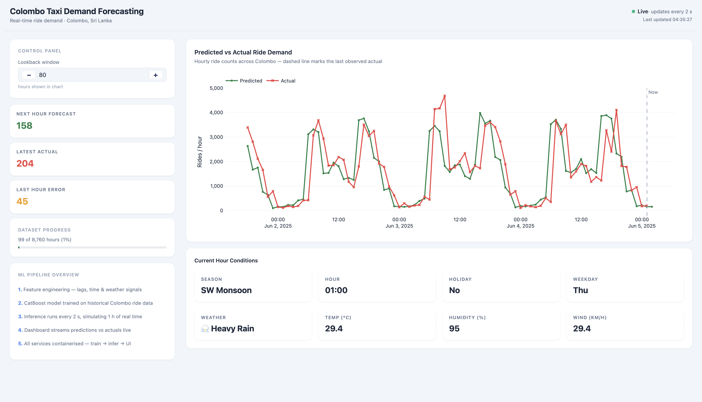

# Taxi Rides Prediction in Colombo, Sri Lanka

<p align="center">
	
</p>

Hourly taxi ride demand forecasting for Colombo using a rule-based synthesized dataset.<br>
Built to production-grade standards: Reproducible Kedro pipelines, Containerised three-service Docker stack (train → infer → UI), Structured logging, and a Live Dash dashboard for real-time demand-forecasting.

---

## Stack

| Layer | Tool |
|---|---|
| Pipeline orchestration | [Kedro](https://kedro.org) 1.1 |
| Model | CatBoost (gradient boosting) |
| Data processing | Pandas, NumPy, scikit-learn |
| Dashboard | Dash + Plotly + Bootstrap |
| Packaging | uv + pyproject.toml |
| Containerisation | Docker + docker-compose |
| Testing / Linting | pytest, ruff |

---

## Project Structure

```
├── src/
│   ├── real_time_prediction/   # Kedro project package
│   │   └── pipelines/          # feature_eng · training · inference nodes
│   └── app_ui/                 # Dash web application
├── entrypoints/                # training.py · inference.py · app_ui.py
├── data/                       # Kedro data layers (01_raw … 08_reporting)
├── conf/                       # Kedro configuration (logging, catalog, params)
├── notebooks/                  # Exploratory modelling notebook
├── tests/                      # pytest test suite
├── Dockerfile
└── docker-compose.yml          # Three-service stack (train → infer → UI)
```

---

## Dataset

The dataset is **synthesised** — ride companies operating in Sri Lanka (PickMe, Uber) do not publicly release historical booking data, so real records are unavailable. Data is instead generated from domain rules grounded in realistic Colombo conditions:

| Column | Description |
|---|---|
| `datetime` | Hourly timestamp |
| `season` | Tropical Sri Lankan seasons: 1 Dry · 2 Pre-Monsoon · 3 SW Monsoon · 4 Post-Monsoon |
| `hour` | Hour of day (0–23) |
| `holiday` | Sri Lankan public holiday flag (Poya days, Independence Day, Avurudu, Vesak, etc.) |
| `weekday` | Day of week (0 Sun – 6 Sat) |
| `weathersit` | 1 Clear · 2 Misty · 3 Light Rain · 4 Heavy Rain/Storm |
| `temp` | Temperature in °C (24–37 °C, Colombo tropical range) |
| `humidity` | Relative humidity % (45–98 %) |
| `windspeed` | Wind speed km/h (0–40 km/h) |
| `ride_count` | Hourly bookings (≈ 80–400 night · 600–2 000 daytime · 1 800–5 000 rush hour) |

---

## Running with Docker

```bash
# dashboard - http://localhost:8050
docker compose up
```

## Running locally

```bash
uv pip install -e .
python entrypoints/training.py
python entrypoints/inference.py
python entrypoints/app_ui.py
```
---

## Citation

If you use this project or the synthesized dataset in your research or build on this work, please cite:

```bibtex
@software{colombo_taxi_demand_2026,
  author    = {Seneviratne, Sithija},
  title     = {Taxi Ride Demand Prediction in Colombo, Sri Lanka},
  year      = {2026},
  url       = {https://github.com/Nivin-Sithija/Taxi-rides-prediction},
  note      = {Synthetic dataset and production-grade ML pipeline using Kedro, CatBoost, and Dash}
}
```
---

## License

MIT License — Copyright (c) 2026 Seneviratne, Sithija.
